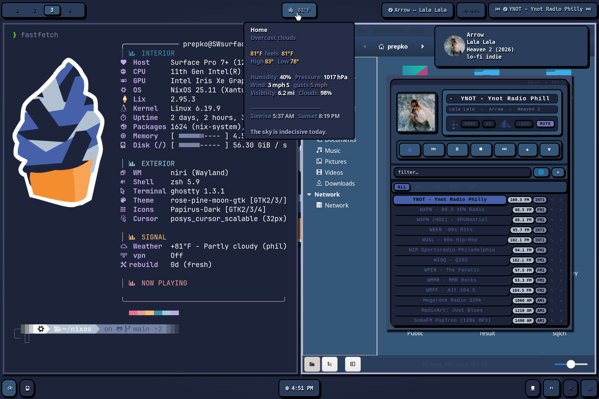
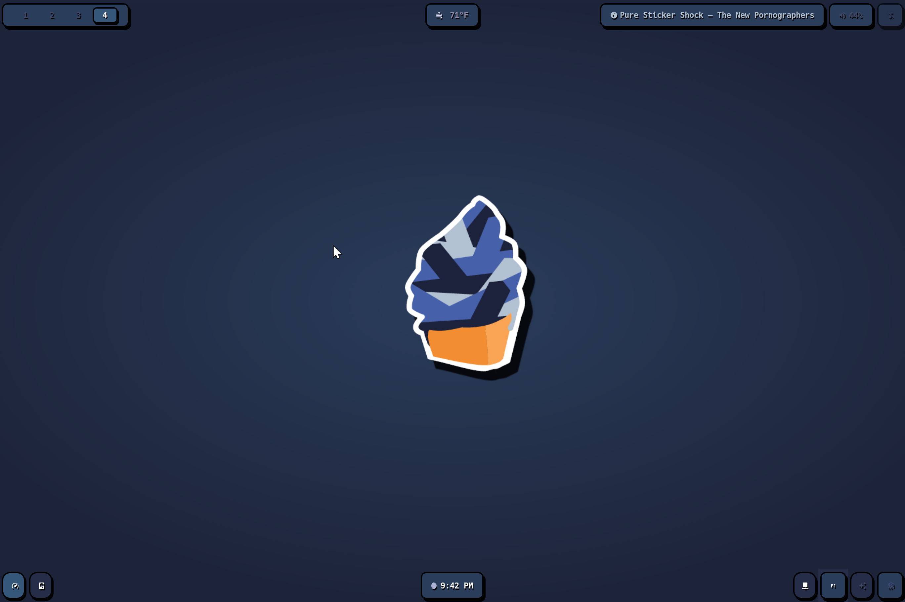

# dotfiles

Multi-host NixOS configuration — desktop + Surface Pro 7+

---

## Hosts

| host | channel | notes |
|------|---------|-------|
| `desktop` | nixpkgs-unstable | i5-9600K, GTX 1660, dual DP monitors |
| `surface` | nixos-25.11 | Surface Pro 7+, linux-surface kernel |
| `family` | nixos-25.11 | HTPC, TV-scale DPI, XFCE |
| `vm-niri` | nixpkgs-unstable | QEMU test VM |

Uses [Lix](https://lix.systems) instead of Nix.

---

## Security / Boot

- **Secure Boot** — lanzaboote with sbctl PKI enrollment
- **LUKS** — TPM2 PCR7-bound auto-unlock on all hosts; desktop has two volumes (root NVMe + 3TB srv/backup)
- **SSH** — key-only auth, no root login, no X11/TCP forwarding
- **Secrets** — sops-nix with age encryption

## Kernel / Hardware

- **linux-surface** — custom 6.19 kernel package with Surface patches (touchscreen, camera, aggregator module)
- **Intel GPU** — VA-API with iHD + i965 fallback, PSR/FBC/DC power tuning
- **NVIDIA** — GSP disabled (Wayland stability), modesetting, runtime power management
- **zram** — zstd-compressed swap on Surface

## Nix

- 4-host flake with per-host nixpkgs pins and home-manager profiles
- Desktop acts as remote builder for Surface (6 jobs over SSH)
- Custom packages overlaid across all hosts: `sqlch`, `uniremote`

## Networking

- **ProtonVPN** — WireGuard Quick, multi-config module, user-controlled without sudo
- **Tailscale** — autostart, loose reverse-path checking
- **Samba** — `/srv/Videos` read-only share with WSDD for Windows discovery
- **Jellyfin** — self-hosted, LAN + Tailscale

## Services

- **IPTV** — local m3u HTTP server (port 8765) with daily EPG + playlist sync via systemd timers
- **Libvirt/KVM** — QEMU with swtpm (TPM2 passthrough to VMs), SPICE USB redirection
- **S.M.A.R.T.** — monitored on desktop (dual drives) and Surface
- **Sleep drain** — systemd service records battery delta per sleep cycle

## Custom packages

- **sqlch** — TUI radio player; MPV backend, MPRIS integration, Textual UI
- **uniremote** — GTK4 remote control for Roku and Samsung devices

## Waybar modules

weather · mpris (ICY metadata, Spotify, ad detection) · sqlch · volume · battery · cpu temp · perf · btrfs · flake drift · clock · bluetooth · network · idle inhibit · power profile · DND · rotation lock · theme switcher · wleave
